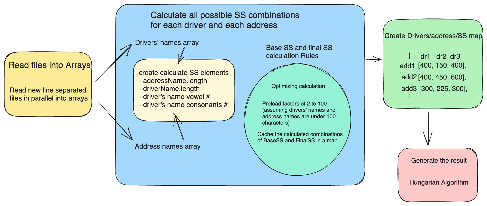

# driver_assignment

Command line tool for assigning drivers to destinations in an optimized way

## Solution Diagram

This program uses `munkres-algorithm` package to optimize the assignments, which solves linear assignment problem in O(n^3).



## Installation dependencies

Prerequisites:
Node version: 18
npm version: 9

```bash
# from the root of the app
npm install -g
```

## Build the application

```bash
npm run build
```

## Run the unit test

```bash
npm run test
```

## Run the application

### To check the command line options

```bash
node build/index.js --help

    Usage: index [options]

    Options:
    -V, --version                output the version number
    --command <command>          command to run (default: "check")
    -h, --help                   display help for command
```

### To Assign Drivers

The application expects two command line arguments --dtPath AND --drPath.
Set them up with file paths to the drivers.txt and destinations.txt files.
The application will output total SS and a matching between shipment destinations and drivers in stdout.

Example of Assign Drivers command:

```bash
node build/index.js --dtPath '../inputFiles/destinations.txt' --drPath '../inputFiles/drivers.txt' > result.txt
```

Example output:

```
Total SS:  40
Matching Drivers and Destinations:  {
  '123 Fake Street, San Diego, CA, 92128': 'Kelly Johnson',
  '234 Franklin Street, Carborro, NC, 70214': 'John Smith',
  '345 Main Road, San Jose, CA, 92123': 'Mary  Doe',
  '456 Jelly Road, San Jose, CA, 94017': 'Cindy Williams'
}
```